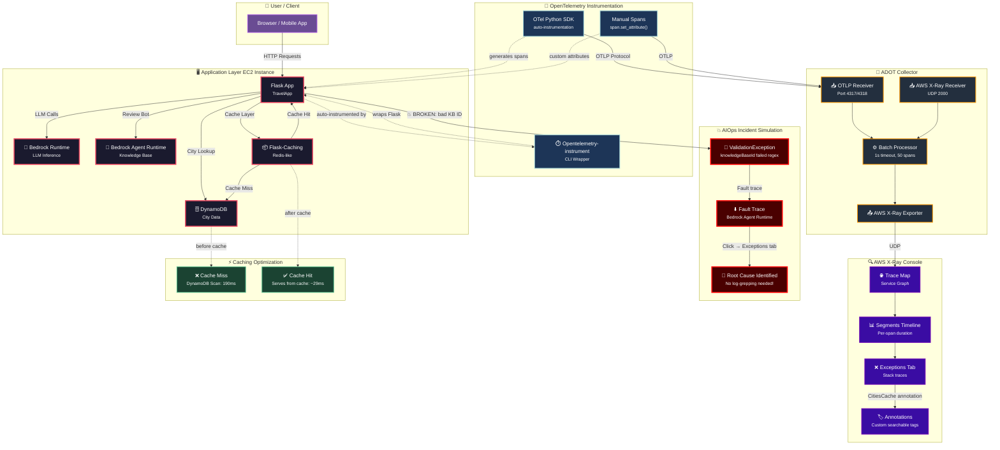

# Observability with OpenTelemetry + AWS X-Ray

> Notes from the AWS Training lab *"DevOps and AI on AWS: AIOps — Instrument the Application and View Traces on X-Ray,"* plus how to port the same setup to a self-hosted project.

---

## AIOps Pipeline Overview



## The AIOps Flow Explained

The diagram above visualizes the complete **AIOps observability pipeline** from the AWS training lab:

1. **User Traffic** → Hits the Flask app (TravelApp) running on EC2
2. **Application** → Calls AWS Bedrock for LLM inference, DynamoDB for city data, and Bedrock Agent Runtime for the review bot knowledge base
3. **Auto-Instrumentation** → `opentelemetry-instrument` wraps Flask with zero code changes — every HTTP request, boto3 call, and DB query becomes a trace span
4. **ADOT Collector** → Receives spans via OTLP or the native X-Ray protocol, batches them, and forwards to AWS X-Ray
5. **X-Ray Console** → Visualizes the service map, per-span timelines, and exception details
6. **Incident Simulation** → Intentionally breaking the knowledge base ID creates a `ValidationException` — the trace map instantly shows the fault is in **Bedrock Agent Runtime**, not the app code
7. **Root Cause** → The Exceptions tab reveals the exact validation failure (`failed regex pattern [0-9a-zA-Z]+`) — no log files to grep through
8. **Caching Optimization** → Adding Flask-Caching reduced DynamoDB lookup from 190ms to ~29ms, confirmed with `CitiesCache` annotation in X-Ray

---

## What is OpenTelemetry (OTel)

OTel is a vendor-neutral standard and set of SDKs for generating and collecting telemetry data — **traces, metrics, and logs** — from a running application, so it can be sent to any backend (X-Ray, Jaeger, Tempo, Datadog) without changing app code.

It is **not** an alternative to Jenkins (CI/CD, build-time) or Prometheus/Grafana (metrics storage + dashboards). OTel sits earlier in the pipeline — it's the instrumentation layer that generates the data those tools consume.

```
Your app → OTel SDK → OTel Collector → exporter → backend (X-Ray / Jaeger / Tempo / Prometheus)
```

## The three observability pillars

| Signal | Answers | Tool used here |
|---|---|---|
| Metrics | Is something wrong? (CPU, error rate) | Prometheus / CloudWatch metrics |
| Logs | What exactly happened? | App logs / CloudWatch Logs |
| Traces | Where in the request chain did it happen? | OTel + X-Ray |

## Install order

1. **ADOT Collector** (AWS's build of the OTel Collector) — a standalone service that receives trace data and forwards it to a backend
   ```bash
   sudo rpm -Uvh /home/ec2-user/aws-otel-collector.rpm
   sudo /opt/aws/aws-otel-collector/bin/aws-otel-collector-ctl -a start
   ```

2. **OTel Python SDK + auto-instrumentation libraries** — patches Flask, boto3, urllib3, etc. to auto-generate spans
   ```bash
   pip3 install aws-opentelemetry-distro==0.10.0
   ```

3. **(Optional) Caching library** — only needed for the manual-instrumentation exercise
   ```bash
   pip3 install Flask-Caching
   ```

## Collector config shape

The Collector config (`config.yaml`) follows a receiver → processor → exporter pipeline:

```yaml
receivers:
  otlp:            # accepts OTLP protocol on 4317 (grpc) / 4318 (http)
  awsxray:          # accepts X-Ray protocol on UDP 2000

processors:
  batch/traces:     # batches spans before sending (1s timeout, 50 per batch)

exporters:
  awsxray:          # forwards traces to AWS X-Ray

service:
  pipelines:
    traces:
      receivers: [otlp, awsxray]
      processors: [batch/traces]
      exporters: [awsxray]
```

This shape is identical in concept to any OTel Collector — only the exporter changes when swapping backends.

## Task sequence performed

**Task 1 — Install and start the Collector**
Installed the RPM, started the systemd service, inspected the config to understand the pipeline.

**Task 2 — Auto-instrument the app**
```bash
export OTEL_PYTHON_DISTRO="aws_distro"
export OTEL_PYTHON_CONFIGURATOR="aws_configurator"
export OTEL_PYTHON_URLLIB3_EXCLUDED_URLS="http://169.254.169.254/"
export OTEL_SERVICE_NAME=TravelApp
opentelemetry-instrument flask run
```
`opentelemetry-instrument` wraps the app's normal start command and injects instrumentation before the app code runs — zero code changes required. Generated traffic through the app (itinerary planner + review bot) to produce trace data.

**Task 3 — Observe traces, then break intentionally**
Viewed the X-Ray trace map (`Client → TravelApp (EC2) → Bedrock Runtime / DynamoDB / Bedrock Agent Runtime`). Then broke the app on purpose:
```bash
KNOWLEDGE_BASE_ID=this_is_broken opentelemetry-instrument flask run
```
This caused the review bot (which calls Bedrock Agent Runtime with a knowledge base ID) to fail. Found the resulting Fault trace in X-Ray and opened the Exceptions tab, which showed the full stack trace:

> `botocore.errorfactory.ValidationException` — 2 validation errors on `knowledgeBaseId`: failed regex pattern `[0-9a-zA-Z]+` and exceeded max length of 10 characters.

This is the core value of distributed tracing: went from "user saw a generic error" to "exact service, exact call, exact validation rule that failed" in a few clicks, no log-grepping.

**Task 4 — Manual instrumentation + caching**
Extracted an app update that added a `Flask-Caching` layer around the DynamoDB city-list lookup, plus a manual span attribute:
```python
span.set_attribute("CitiesCache", True/False)
```
This is the distinction between auto- and manual instrumentation: auto-instrumentation captures generic technical events (HTTP request happened, boto3 call happened); manual instrumentation lets you tag traces with business-specific context you decide matters.

Queried X-Ray for `annotation[CitiesCache]` and compared two real traces:

| | Cache miss | Cache hit |
|---|---|---|
| DynamoDB call | `Scan: Cities`, 190ms | none |
| Total duration | 193ms | ~29ms |

Confirmed the caching feature works with real measured latency, not assumptions.

## Key concepts

- **Span** — a single traced unit of work (one HTTP request, one DB call, one Bedrock call)
- **Trace** — a tree of spans representing one full request's journey across services
- **Segment / Segments Timeline** — X-Ray's view of a trace broken into named steps with duration and status
- **Annotation** — a custom key-value tag on a span, indexed so it's searchable/queryable
- **Auto-instrumentation** — library-level patching that generates spans with no app code changes
- **Manual instrumentation** — explicit `span.set_attribute()` calls added by the developer for business-specific context
- **Sampling** — not every request is guaranteed to be traced; X-Ray samples a subset by default, which is why heavy traffic bursts are sometimes needed to see specific traces

## Porting this to a self-hosted project (no AWS X-Ray)

Swap the AWS-specific pieces for open-source equivalents:

| Lab (AWS) | Self-hosted equivalent |
|---|---|
| ADOT Collector | Standard OpenTelemetry Collector |
| AWS X-Ray | Jaeger or Grafana Tempo |
| `aws-opentelemetry-distro` | Plain `opentelemetry-distro` + `opentelemetry-exporter-otlp` |
| `awsxray` exporter | `otlp` exporter pointing at Jaeger/Tempo |

### Minimal setup for `traffic_Devops` (or any Flask/worker service)

1. Add to `requirements.txt`:
   ```
   opentelemetry-distro
   opentelemetry-exporter-otlp
   ```

2. Run Jaeger locally via docker-compose:
   ```yaml
   jaeger:
     image: jaegertracing/all-in-one:latest
     ports:
       - "16686:16686"   # Jaeger UI
       - "4317:4317"     # OTLP gRPC receiver
   ```

3. Launch each service (worker / API / dashboard) with a distinct service name:
   ```bash
   OTEL_SERVICE_NAME=traffic-api opentelemetry-instrument \
     --exporter_otlp_endpoint=http://localhost:4317 \
     flask run
   ```

4. Open `http://localhost:16686` — same concept as the X-Ray console, shows the trace map across all three services once each is instrumented and traffic flows between them.
